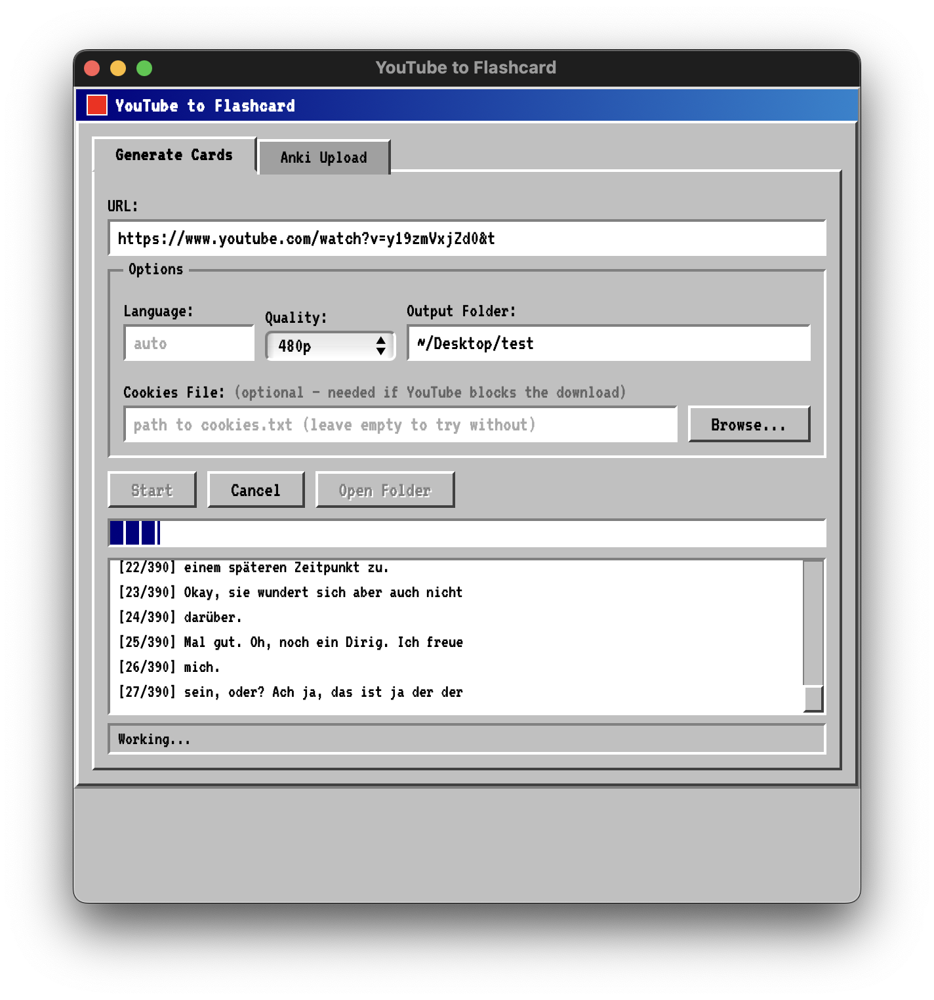
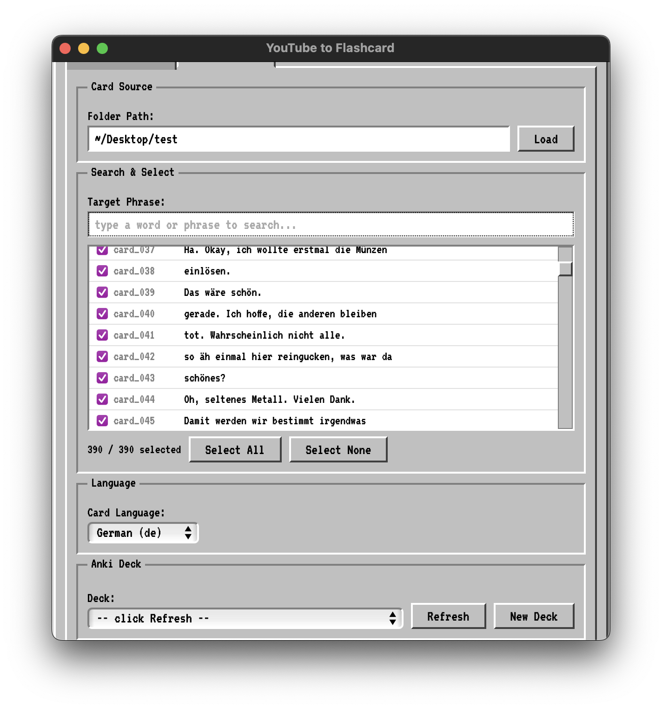
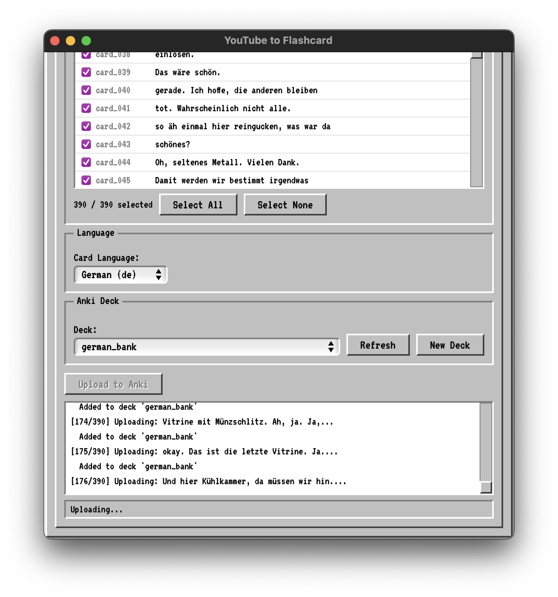

# YouTube to Flashcard

Turn any captioned YouTube video into study-ready flashcard assets — one folder per caption line, each containing an audio clip, a video frame, and the subtitle text. Then upload directly to Anki.



## What It Does

1. Downloads a YouTube video via `yt-dlp`
2. Extracts captions (manual or auto-generated)
3. Splits the video into per-sentence segments
4. Saves each segment as a **card** folder:

```
card_001/
  audio.mp3   — the spoken line
  frame.jpg   — screenshot from that moment
  text.txt    — the caption text
```

5. **Anki Upload** — search through generated cards, select sentences, and upload to Anki with:
   - Sentence + audio + screenshot
   - Dictionary lookups (German or Japanese)
   - Word-level TTS audio

## Screenshots

### Searching through downloaded cards



### Uploading to Anki



## Supported Languages

| Language | EN Dictionary | Native Dictionary | TTS Voice |
|----------|--------------|-------------------|-----------|
| German | dict.cc | DWDS / Wiktionary | Anna (macOS) |
| Japanese | Jisho.org | Kotobank | Kyoko (macOS) |

## Example Output

Source: [Resident Evil Requiem #09](https://www.youtube.com/watch?v=lwTqv3m1SSs) (German auto-captions)

**Frame:**


**Text:**
```
gerade glaube ich hier ein bisschen
```

**Audio:** [Listen to audio clip](readme_assets/output/card_008/audio.mp3)

## Requirements

- Python 3.10+
- [`yt-dlp`](https://github.com/yt-dlp/yt-dlp)
- [`ffmpeg`](https://ffmpeg.org/)
- [Node.js](https://nodejs.org/) (required for YouTube's JS challenge solver)
- [Anki](https://apps.ankiweb.net/) + [AnkiConnect](https://ankiweb.net/shared/info/2055492159) (for Anki upload feature)

### macOS (Homebrew)

```bash
brew install yt-dlp ffmpeg node
```

### Python dependencies

```bash
pip install pywebview psutil
```

## Quick Start

### Run the desktop app

```bash
python app.py
```

Or double-click the `YouTube to Flashcard.app` if you have the built app.

### Or use the CLI

```bash
python youtube_to_cards.py "https://www.youtube.com/watch?v=VIDEO_ID"
python youtube_to_cards.py "https://www.youtube.com/watch?v=VIDEO_ID" -o my_cards -l de
```

## Options

| Flag | Description | Default |
|------|-------------|---------|
| `-o`, `--output` | Output directory | `output` |
| `-l`, `--lang` | Caption language code (e.g. `en`, `de`, `ja`) | auto-detect |

## Notes

- Only works with videos that have captions (manual or auto-generated). Videos without captions will show an error.
- Video quality can be set to 480p or 720p in the app to balance download speed and quality.
- If YouTube blocks the download with a bot check, make sure you are logged into YouTube in Chrome. The app automatically uses Chrome cookies for authentication.
- As a fallback, you can export cookies via the "Get cookies.txt LOCALLY" browser extension and load them in the app.
- Auto-generated captions are automatically de-duplicated to remove repeated fragments.
