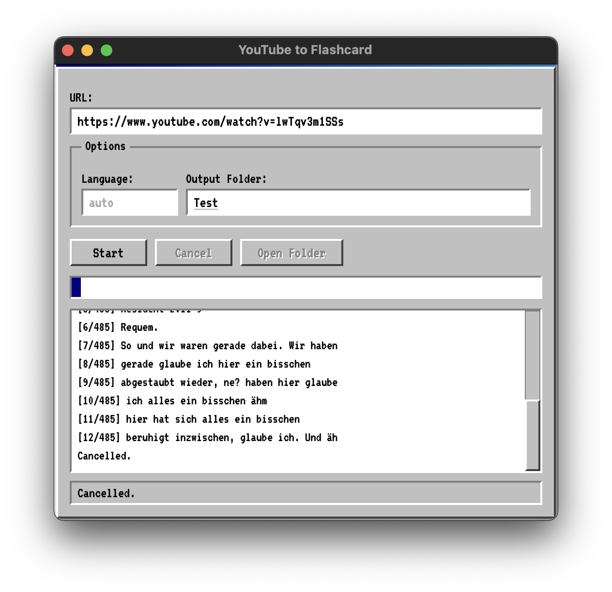

# YouTube to Flashcard

Turn any captioned YouTube video into study-ready flashcard assets.

This app downloads a video, pulls captions, and creates one folder per caption segment with:
- `audio.mp3` (the spoken line)
- `frame.jpg` (a screenshot from that exact moment)
- `text.txt` (the caption text)

It includes:
- A native desktop GUI (Python + pywebview)
- A CLI for scripting and batch workflows

## App Example Screen (example_screen)



## Real Output Example (card_009)

Source video: https://www.youtube.com/watch?v=lwTqv3m1SSs

### Image


### Audio (playable)

<audio controls preload="metadata">
	<source src="output/card_009/audio.mp3" type="audio/mpeg">
	Your browser does not support the audio element.
</audio>

### Text

```text
abgestaubt wieder, ne? haben hier glaube
```

## How It Works

1. Fetch video metadata with `yt-dlp`
2. Select caption language (manual subtitles preferred, auto captions fallback)
3. Download video and subtitles
4. Parse and clean SRT caption lines
5. Extract an audio clip and frame per caption segment using `ffmpeg`
6. Save card folders and write `metadata.json`

## Requirements

- Python 3.10+
- `yt-dlp` available on your PATH
- `ffmpeg` available on your PATH
- Python packages:
	- `pywebview`
	- `psutil` (optional but recommended for robust cancellation)

## Quick Start

### 1) Install dependencies

```bash
pip install pywebview psutil
```

Install `yt-dlp` and `ffmpeg` with your preferred package manager.

### 2) Run the desktop app

```bash
python app.py
```

### 3) Or run the CLI

```bash
python youtube_to_cards.py "https://www.youtube.com/watch?v=VIDEO_ID" -o output -l de
```

## Output Structure

```text
output/
	metadata.json
	card_001/
		audio.mp3
		frame.jpg
		text.txt
	card_002/
		...
```

## Notes

- If caption download is rate-limited by YouTube, retry later or pass an explicit language code.
- Automatic captions are de-duplicated to reduce repeated fragments.
- The included `output/card_009` files are a generated sample for previewing result quality.
